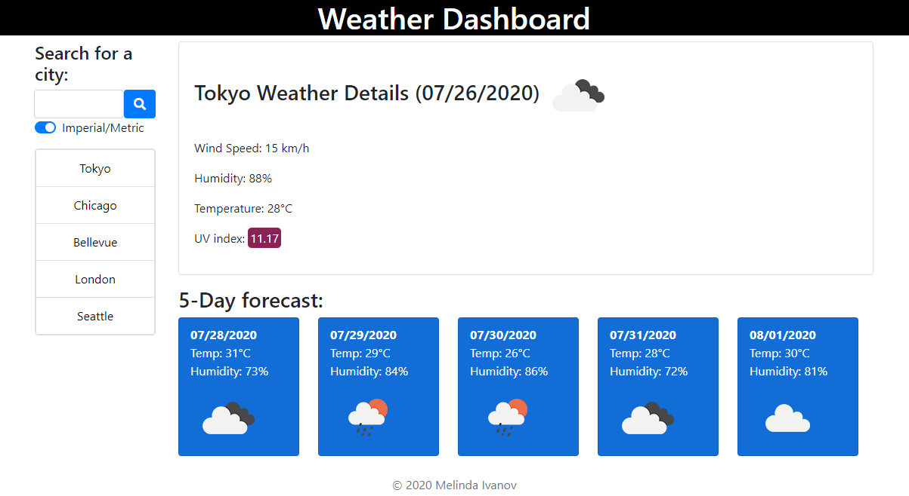

# Weather-Dashboard
When the user searches for a city then presented with current and future conditions for that city and that city is added to the search history. The user can view the current weather conditions for that city and presented with the city name, the date, an icon representation of weather conditions, the temperature, the humidity, the wind speed, and the color coded UV index. Bellow the user can view future weather conditions for that city and presented with a 5-day forecast that displays the date, an icon representation of weather conditions, the temperature, and the humidity. When the user clicks on a city in the search history, presented with current and future conditions for that city again. When the user opens the weather dashboard then presented with the last searched city forecast or the location based on the IP address at the wery first use. The user can choose to get the data displayed in imperial or metric units (default: metric).

**Author:** Melinda Ivanov

demo image:

## Links
- https://github.com/jnsmelinda/Work-Day-Scheduler
- https://jnsmelinda.github.io/Work-Day-Scheduler

## Technologies
- [JavaScript](https://www.javascript.com)
- [JQuery](https://jquery.com/)
- [HTML5](https://en.wikipedia.org/wiki/HTML5)
- [CSS3](https://en.wikipedia.org/wiki/Cascading_Style_Sheets)
- [Git](https://git-scm.com/), [GitHub](https://github.com)
- [Github Pages](https://pages.github.com)

## Steps of developement
- adding project skeleton files
- create .editorconfig
- importing moment.js
- displaying data by user input
- getting location of the user by IP
- getting UV index
- getting forecast temperature and forecast humidity
- adding forecast cards with dates
- adding forecast icons
- saving search history to localstorage
- creating clickable search history
- rendering current weather dinamically
- color coding UV
- adding footer
- error handling
- metric/imperial unit switch
- desing to fit all screen sizes
- fixing styling
- adding eslint and fixing linting problems
- refactor/clean-up
- readme

## Others
Original desing is from the [University of Washington coding bootcamp](https://bootcamp.uw.edu).

© 2020 Melinda Ivanov
